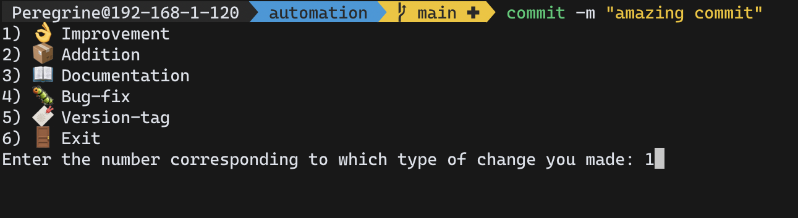

# Git Commit Emojis


  


A simple cross platform python script that automates easy labelling of git commits with descriptive emojis and text. Issues, PRs and suggestions more than welcome.

## About
We all like a bit of extra color and spice to our boring old commit messages, this not only adds that but also adds information about the commit.

## Installation
Since the project will continue to be updated and isn't on pypi, you can clone the repository and create a CLI command linking to the cloned repository  
I am currently investigating the best way to allow this tool to be easily installed and used on all platforms. Meanwhile if you can help, please open an issue.

*****Mac OS**  
```sh
git clone https://github.com/TechWiz-3/git-commit-emojis.git
cp commit /usr/local/bin/<name you wish to give the command (I recommend gc or commit)>
chmod +x /usr/local/bin/<name>
```

## Usage

## The Story
So I noticed that [this](https://github.com/msaaddev) programmer's commits always had really neat looking labels with emojis. I searched it up and found a number of repositories or gists talking about emojis for various sorts of commits.  
However, I couldn't find ANY projects which automated the experience. Weird, right? [One](https://github.com/ahmadawais/Emoji-Log) project had a way to somewhat automate the experience by adding a function for each commit type. While a nice solution, I don't want to have to memorise the abbreviations/commands type of commit. Well no more, with this project, I can now label all my commits in mere seconds without having to memorise anything.

Here are the emoji guides mentioned above, they are all great and this project wouldn't be possible without them so be sure to check them out:  
* [Git command emoji gist](https://gist.github.com/parmentf/035de27d6ed1dce0b36a)  
* [Emoji-log](https://github.com/ahmadawais/Emoji-Log)  
* [Git commit emoji](https://github.com/liuchengxu/git-commit-emoji-cn)  


## Label Guide
### Select Menu Options
Usage:  
```
commit -m "your commit message (with or without quotes)"
```

  
👌 Improvement = `👌 IMPROVE: <commit message>`  
📦 Addition = `📦 NEW: <commit message>`  
📖 Documentation = `📖 DOC: <commit message>`  
🐛 Bug-fix = `🐛 FIX: <commit message>`  
🔖 Version-tag = `🔖 <commit message>`  

### Shorcut Options:
Usage:  
```
commit -sh <shortcut>
```
Shortcuts:  

`ty`     commit message defaults to: `✏️ FIX TYPO`  

`cl`     commit message defaults to: `🧹 CLEAN UP`  

`in`     commit message defaults to: `🎉 INITIAL COMMIT`  
